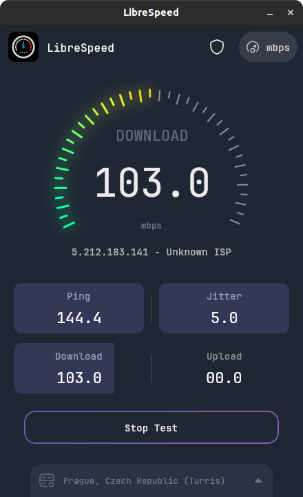
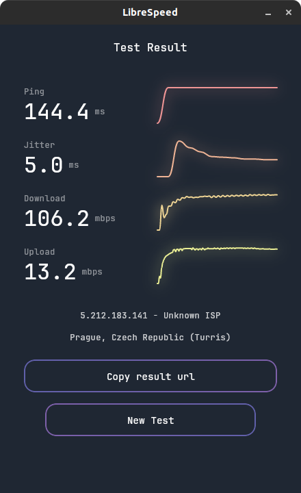

# LibreSpeed Desktop App (Compose)

<p>


</p>

This is a Compose Desktop based client for LibreSpeed servers, a template similar to the Android app.

It is still WIP, it's not documented yet, but it works and it can be configured by editing the configuration files in `src/main/resources/configs/`.

This application is developed and maintained by Sudo Dios.

## Screenshots
|                                                |                                                |
|------------------------------------------------|------------------------------------------------|
|  |  |

## Installation
you can download latest version of this from [releases page](https://github.com/librespeed/speedtest-desktop/releases)

## Build
```shell
git clone -b compose-desktop --single-branch https://github.com/librespeed/speedtest-desktop.git
cd speedtest-desktop
./gradlew run
```

## License
Copyright (C) 2016-2021 Federico Dossena\
Copyright (C) 2021-2023 Sudo Dios

This program is free software: you can redistribute it and/or modify
it under the terms of the GNU Lesser General Public License as published by
the Free Software Foundation, either version 3 of the License, or
(at your option) any later version.

This program is distributed in the hope that it will be useful,
but WITHOUT ANY WARRANTY; without even the implied warranty of
MERCHANTABILITY or FITNESS FOR A PARTICULAR PURPOSE.  See the
GNU General Public License for more details.

You should have received a copy of the GNU Lesser General Public License
along with this program.  If not, see <https://www.gnu.org/licenses/lgpl>.
